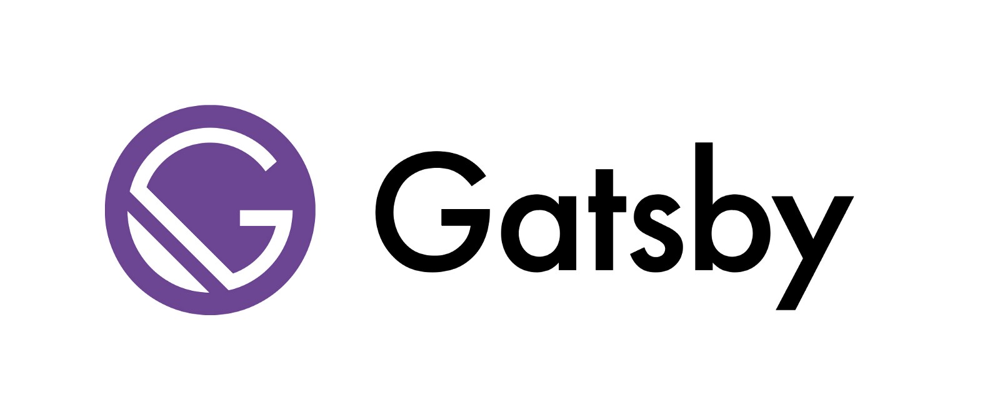

This blog is made of
[GatsbyJS](https://www.gatsbyjs.org).  
In creating blog, I had to choice what is the best way to my blog.  
At first, WordPress came up in my mind. It's so popular and easy to use.
But I didn't have to lots of functions and wanted to write front-end.
Then I read some articles and found GatsbyJS. So I gonna describe the reason for choosing.

## 1. Static site

Main reason is GatsbyJS is static site generator, not dynamic site like WordPress.
WordPress is CMS and creates database. It needs update plugin. But I might not be access this blog every day, so management seems to be troublesome in WordPress. At this point, static site generator don't have to care about update well.  
Also, static site is fast. It's not need database, just web pages. And I didn't need authentication, chose this.

## 2. React based
GatsbyJS is
[React](https://reactjs.orgs)
based. I thought customize theme, but I didn't want to write php tag. Also there are lots of theme for WordPress, it has no meaning to make original one. But React, I'm able to write style and learn how to write JSX, modern development methods. It maybe useful for a job as front-end.

## 3. Markdown
Articles are able to use markdown. Ashamed to say, I'm not really used to this, so I have to learn. In addition, it's possible to select editor. Cause I often use Visual Studio Code and Vim, it's good way to use markdown.

### Other options
* WordPress + [KUSANAGI](https://en.kusanagi.tokyo/about/)

KUSANAGI is a fast WordPress virtual machine. If I chose WordPress, wanna try this.

* [VuePress](https://vuepress.vuejs.org)

It's a vue based static site generator. I've experienced vue.js project before, this time will try to React.

* [Medium](https://medium.com) or [note](https://note.mu)
As you know, they are web services for writing. note is similar service to Medium. It's very popular in Japan and good design.
