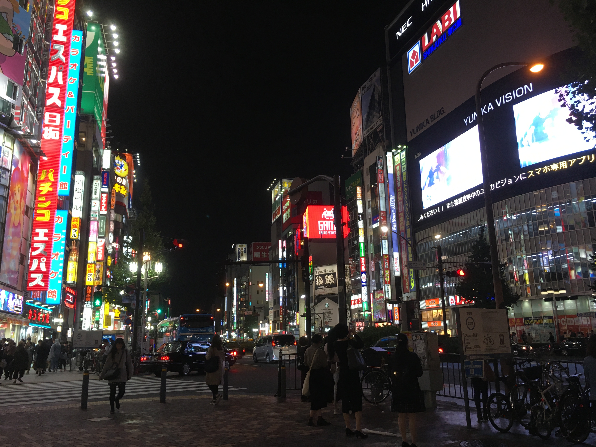
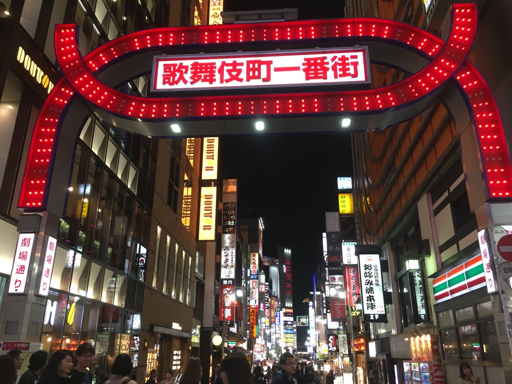

Recently, I read lonely planet Tokyo.  
There are lots of good information about famous sightseeing spots in the city.
It's a really useful book. But I had a question about restaurants because I'm not familiar with them despite being a local.  
 Also, I was walking downtown, foreigners asked me about the way. They wanted to go to some restaurant, but I didn't know where that restaurant was. I think tourists like to go to restaurants but those restaurants are expensive.  
  So in this article, as a local, I'm going to introduce affordable tourism plan around Shinjuku. This plan is good for backpackers and students.

## About Shinjuku station

 
[Shinjuku](https://en.wikipedia.org/wiki/Shinjuku)
is a big city in Tokyo. Shinjuku station is the busiest station in the world. There are many sightseeing spots and restaurants. When meeting a friend, I often go to restaurants in Shinjuku. In this station, their are many tourists and locals around.

## Tips
### 1. Go to Shinjuku from evening
In the afternoon, you should go to the other city. Shinjuku is downtown, so visiting at night is better. The billboards are beautiful at night and provide enough light, so you can go walking around even at night time.

### 1. Use chain stores and eat a lot
You can eat a lot Japanese food in chain restaurants. Locals often go to chain restaurant and enjoy meals for a low price. In Shinjuku, there are many chain restaurants.

### 2. Don't eat a lot in Japanese pubs
In Japanese pubs, 'Izakaya' in Japanese, you should just have a drink. It's recommended not to have a meal in a japanese pub.
Because there are so many good restaurants for eating. Also food in Japanese pubs is expensive. 

### 3. Go to public bath place, no need to spend money hot spring
If you have available free time, I strongly recommend you to go and visit a public bath place, 'Sento' in Japanese. This is because you will feel the local japanese style.

## Plan
### 1. Having a meal at Yoshinoya or Ootoya or Omoide-yokocho.
### 2. Waking in Kabuki-cho 
### 2. Drinking at Hanbee or Medaka
### 4. 【Time permitting】Going to public bath at Kosugi-yu in Koenji